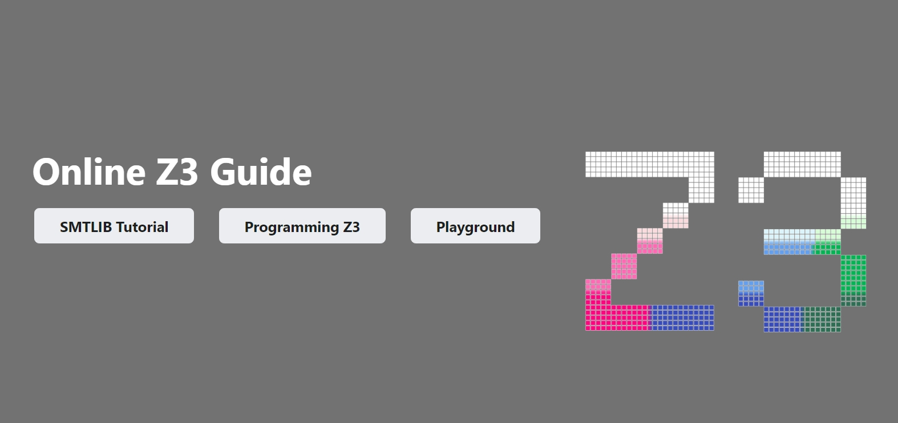

# Z3

Z3 is a theorem prover from Microsoft Research. 
It is licensed under the [MIT license](LICENSE.txt). Windows binary distributions include [C++ runtime redistributables](https://visualstudio.microsoft.com/license-terms/vs2022-cruntime/)

If you are not familiar with Z3, you can start [here](https://github.com/Z3Prover/z3/wiki#background).

Pre-built binaries for stable and nightly releases are available [here](https://github.com/Z3Prover/z3/releases).

Z3 can be built using [Visual Studio][1], a [Makefile][2], using [CMake][3],
using [vcpkg][4], or using [Bazel][5].
It provides [bindings for several programming languages][6].

See the [release notes](RELEASE_NOTES.md) for notes on various stable releases of Z3.

[](https://microsoft.github.io/z3guide/)

## Build status

| Azure Pipelines |  Open Bugs | Android Build | WASM Build | Windows Build | Pyodide Build | OCaml Build |
| --------------- | -----------|---------------|------------|---------------|---------------|-------------|
| [](https://dev.azure.com/Z3Public/Z3/_build/latest?definitionId=1&branchName=master) |  [](https://github.com/Z3Prover/z3/actions/workflows/wip.yml) |[](https://github.com/Z3Prover/z3/actions/workflows/android-build.yml) | [](https://github.com/Z3Prover/z3/actions/workflows/wasm.yml) | [](https://github.com/Z3Prover/z3/actions/workflows/Windows.yml) | [](https://github.com/Z3Prover/z3/actions/workflows/pyodide.yml) | [](https://github.com/Z3Prover/z3/actions/workflows/ocaml-all.yaml) |

[1]: #building-z3-on-windows-using-visual-studio-command-prompt
[2]: #building-z3-using-make-and-gccclang
[3]: #building-z3-using-cmake
[4]: #building-z3-using-vcpkg
[5]: #building-z3-using-bazel
[6]: #z3-bindings

## Building Z3 on Windows using Visual Studio Command Prompt

For 32-bit builds, start with:

```bash
python scripts/mk_make.py
```

or instead, for a 64-bit build:

```bash
python scripts/mk_make.py -x
```

then run:

```bash
cd build
nmake
```

Z3 uses C++20. The recommended version of Visual Studio is therefore VS2019 or later. 

## Building Z3 using make and GCC/Clang

Execute:

```bash
python scripts/mk_make.py
cd build
make
sudo make install
```

Note by default ``g++`` is used as C++ compiler if it is available. If you
prefer to use Clang, change the ``mk_make.py`` invocation to:

```bash
CXX=clang++ CC=clang python scripts/mk_make.py
```

Note that Clang < 3.7 does not support OpenMP.

You can also build Z3 for Windows using Cygwin and the Mingw-w64 cross-compiler.
In that case, make sure to use Cygwin's own Python and not some Windows installation of Python.

For a 64-bit build (from Cygwin64), configure Z3's sources with
```bash
CXX=x86_64-w64-mingw32-g++ CC=x86_64-w64-mingw32-gcc AR=x86_64-w64-mingw32-ar python scripts/mk_make.py
```
A 32-bit build should work similarly (but is untested); the same is true for 32/64 bit builds from within Cygwin32.

By default, it will install z3 executables at ``PREFIX/bin``, libraries at
``PREFIX/lib``, and include files at ``PREFIX/include``, where the ``PREFIX``
installation prefix is inferred by the ``mk_make.py`` script. It is usually
``/usr`` for most Linux distros, and ``/usr/local`` for FreeBSD and macOS. Use
the ``--prefix=`` command-line option to change the install prefix. For example:

```bash
python scripts/mk_make.py --prefix=/home/leo
cd build
make
make install
```

To uninstall Z3, use

```bash
sudo make uninstall
```

To clean Z3, you can delete the build directory and run the ``mk_make.py`` script again.

## Building Z3 using CMake

Z3 has a build system using CMake. Read the [README-CMake.md](README-CMake.md)
file for details. It is recommended for most build tasks, 
except for building OCaml bindings.

## Building Z3 using vcpkg

vcpkg is a full platform package manager. To install Z3 with vcpkg, execute:

```bash
git clone https://github.com/microsoft/vcpkg.git
./bootstrap-vcpkg.bat # For powershell
./bootstrap-vcpkg.sh # For bash
./vcpkg install z3
```

## Building Z3 using Bazel

Z3 can be built using [Bazel](https://bazel.build/). This is known to work on
Ubuntu with Clang (but may work elsewhere with other compilers):
```
bazel build //...
```

## Dependencies

Z3 itself has only few dependencies. It uses C++ runtime libraries, including pthreads for multi-threading.
It is optionally possible to use GMP for multi-precision integers, but Z3 contains its own self-contained 
multi-precision functionality. Python is required to build Z3. Building Java, .NET, OCaml and 
Julia APIs requires installing relevant toolchains.

## Z3 bindings

Z3 has bindings for various programming languages.

### ``.NET``

You can install a NuGet package for the latest release Z3 from [nuget.org](https://www.nuget.org/packages/Microsoft.Z3/).

Use the ``--dotnet`` command line flag with ``mk_make.py`` to enable building these.

See [``examples/dotnet``](examples/dotnet) for examples.

### ``C``

These are always enabled.

See [``examples/c``](examples/c) for examples.

### ``C++``

These are always enabled.

See [``examples/c++``](examples/c++) for examples.

### ``Java``

Use the ``--java`` command line flag with ``mk_make.py`` to enable building these.

See [``examples/java``](examples/java) for examples.

### ``OCaml``

Use the ``--ml`` command line flag with ``mk_make.py`` to enable building these.

See [``examples/ml``](examples/ml) for examples.

### ``Python``

You can install the Python wrapper for Z3 for the latest release from pypi using the command:

```bash
   pip install z3-solver
```

Use the ``--python`` command line flag with ``mk_make.py`` to enable building these.

Note that it is required on certain platforms that the Python package directory
(``site-packages`` on most distributions and ``dist-packages`` on Debian-based
distributions) live under the install prefix. If you use a non-standard prefix
you can use the ``--pypkgdir`` option to change the Python package directory
used for installation. For example:

```bash
python scripts/mk_make.py --prefix=/home/leo --python --pypkgdir=/home/leo/lib/python-2.7/site-packages
```

If you do need to install to a non-standard prefix, a better approach is to use
a [Python virtual environment](https://virtualenv.readthedocs.org/en/latest/)
and install Z3 there. Python packages also work for Python3.
Under Windows, recall to build inside the Visual C++ native command build environment.
Note that the ``build/python/z3`` directory should be accessible from where Python is used with Z3 
and it requires ``libz3.dll`` to be in the path.

```bash
virtualenv venv
source venv/bin/activate
python scripts/mk_make.py --python
cd build
make
make install
# You will find Z3 and the Python bindings installed in the virtual environment
venv/bin/z3 -h
...
python -c 'import z3; print(z3.get_version_string())'
...
```

See [``examples/python``](examples/python) for examples.

### ``Julia``

The Julia package [Z3.jl](https://github.com/ahumenberger/Z3.jl) wraps the C API of Z3. A previous version of it wrapped the C++ API: Information about updating and building the Julia bindings can be found in [src/api/julia](src/api/julia).

### ``WebAssembly`` / ``TypeScript`` / ``JavaScript``

A WebAssembly build with associated TypeScript typings is published on npm as [z3-solver](https://www.npmjs.com/package/z3-solver). Information about building these bindings can be found in [src/api/js](src/api/js).

### Smalltalk (``Pharo`` / ``Smalltalk/X``)

Project [MachineArithmetic](https://github.com/shingarov/MachineArithmetic) provides a Smalltalk interface
to Z3's C API. For more information, see [MachineArithmetic/README.md](https://github.com/shingarov/MachineArithmetic/blob/pure-z3/MachineArithmetic/README.md).

## System Overview


## Interfaces

* Default input format is [SMTLIB2](http://smtlib.cs.uiowa.edu)

* Other native foreign function interfaces:
* [C++ API](https://z3prover.github.io/api/html/namespacez3.html)
* [.NET API](https://z3prover.github.io/api/html/namespace_microsoft_1_1_z3.html)
* [Java API](https://z3prover.github.io/api/html/namespacecom_1_1microsoft_1_1z3.html)
* [Python API](https://z3prover.github.io/api/html/namespacez3py.html) (also available in [pydoc format](https://z3prover.github.io/api/html/z3.html))
* [Rust](https://github.com/prove-rs/z3.rs)
* C
* OCaml
* [Julia](https://github.com/ahumenberger/Z3.jl)
* [Smalltalk](https://github.com/shingarov/MachineArithmetic/blob/pure-z3/MachineArithmetic/README.md) (supports Pharo and Smalltalk/X)

## Power Tools
* The [Axiom Profiler](https://github.com/viperproject/axiom-profiler-2) currently developed by ETH Zurich


