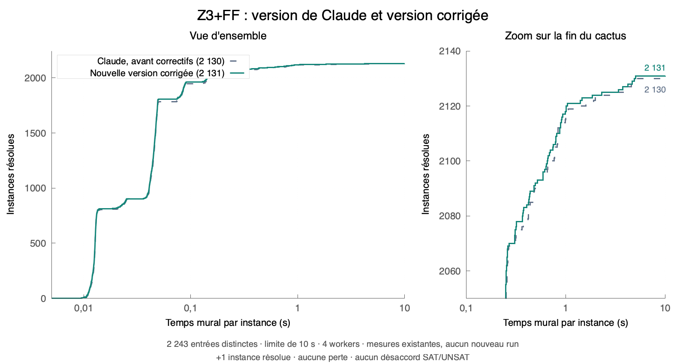

# Corrected fixed-width finite-field backend

The twelve-patch Claude backend has been integrated into the local fork with
bounded uniqueness, iterative traversal/search, portable fallback and stronger
F4 admission guards. The final comparison preserves all 2,104 primary successes,
recovers the lost held-out Bits2Num circuit and fixes the deep-expression crash.
This solver snapshot is the baseline for a follow-up certificate PR covering
the new F4, uniqueness and tiny-field search paths. The earlier standalone
Alethe/PAC infrastructure remains part of its history.

## Measured acceptance

Fresh paired native arm64 runs of the frozen submitted and corrected binaries,
10-second external deadline, four workers, identical input bytes and a shuffled
schedule. The 2,212 primary and 32 held-out inputs overlap on one file: there
are **2,243 distinct inputs and 4,486 runs**, not 2,244 distinct inputs.

| Screen | Inputs | Submitted version | Corrected version |
|---|---:|---:|---:|
| Primary | 2,212 | 2,104 | **2,104** |
| Held-out | 32 | 27 | **28** |
| Deduplicated union | 2,243 | 2,130 | **2,131** |

There is **one gain, zero losses, zero SAT/UNSAT disagreements, zero process
errors and zero known-oracle mismatches**. The one gain is
`Bits2Num_strict@bitify@circomlib.smt2`. Every primary status agrees input by
input, not just in aggregate. Primary family coverage remains 720/782
determinism circuits, 754/771 soundness circuits, 297/325 FFSAT systems,
27/28 dense generated systems, 6/6 underdetermined systems, 200/200
exhaustive-oracle cases and 100/100 large-field differential cases.

On the primary shared successes, cumulative elapsed time is **147.828 versus
145.112 seconds**. This supports comparable aggregate performance, not a
uniform speedup. On the 27 shared held-out successes it is **5.027 versus
3.050 seconds**. The recovered circuit is excluded from that shared-success
timing. The submitted version's earlier review had a different timing total;
the comparison here uses fresh paired runs of both executables.

The campaign did not reserve the machine exclusively. Short correctness and
portable-fallback checks ran during parts of it; the full native fork rebuild
started only after the benchmark finished. Serial follow-ups started after that
rebuild. Primary rows retain their original measurements and have not been
replaced by follow-up times.

Three serial repeats per configuration, medians below, cover the three primary/
held-out timing outliers and the known earlier regressions:

| Input | Submitted | Corrected |
|---|---:|---:|
| `compilation-deterministic-random-02v-016t-ff-circ-255b-0s.smt2` | 0.121 s | 0.122 s |
| `compilation-deterministic-last-10v-000t-ff-zokref-255b-ands.smt2` | 0.116 s | 0.114 s |
| `GreaterThan@comparators@circomlib_16.smt2` | 0.041 s | 0.039 s |
| `compilation-deterministic-none-06v-128t-ff-circ-255b-0s.smt2` | 0.175 s | 0.043 s |
| `Bits2Num@bitify@circomlib_254.smt2` | 2.000 s | 0.168 s |
| `Bits2Num_strict@bitify@circomlib.smt2` | timeout (3/3) | 0.386 s |
| `bitsum_16_layers_4.smt2` | 0.273 s | 0.112 s |
| `bitsum_21_layers_5.smt2` | 0.536 s | 0.147 s |

## Cactus

[Vector PDF](qf-ff-backend-corrected-cactus.pdf). The figure reuses the paired
measurements above; no benchmark was rerun to draw it. Only SAT/UNSAT answers
are counted. The right panel magnifies the tail; no cvc5 measurements from
a different corpus are mixed into this comparison.

## Corrections

* **Depth-safe uniqueness encoding.** An explicit postorder DAG traversal
  replaces recursive AST descent. A 60,000-level negation query now returns
  SAT; standalone uniqueness returns unknown as expected for that SAT goal.
  Polynomial term admission is checked during construction, and exponential
  one-term degree growth is rejected before allocating an oversized monomial.
* **One allowance for the whole uniqueness attempt.** Encoding, canonicalization,
  gadget matching, propagation and branch exploration share
  `ff.unique_work` (default 1,000,000). Propagation gives up after one tenth of
  the allowance without a new equality or value. Productive chains can use the
  total allowance; progress never replenishes that total. Local exhaustion
  preserves the original goal and does not cancel the fallback solver.
  Shared cancellation is polled within the work loops. Boolean split depth has
  a hard stack-safety cap of 64 in addition to the default depth of 16 and
  50,000-node bound. `ff.unique`, `ff.unique_work`, `ff.unique_nodes`,
  `ff.unique_depth` and `ff.unique_equalities` have registered SMT parameters.
* **Avoid redundant affine work.** Nonlinear zero-test matching only considers
  variables with nonlinear occurrences. Canonical bit dependencies are tried
  before copying affine definitions separately for every Boolean digit. These
  are structural heuristics, with no benchmark-name, circuit-name or hash checks.
  Skipped speculative reasoning leaves all constraints for the existing solver.
* **Compiler portability.** Bit operations use C++20 facilities. A capability
  guard excludes the fixed-width implementation when 128-bit integers are not
  available; F4 then reports unsupported, leaving tiny-field search and the
  existing arbitrary-precision/BV paths available. Native MSVC was **not** run
  on this macOS host. The no-128-bit branch was force-compiled, linked and tested
  with `Z3_FF_HAS_UINT128=0`. This is portable fallback, not equal F4 performance
  on Windows.
* **F4 admission and recovery.** The variable bound includes disequality
  auxiliaries. Every monomial interning path checks admission before allocating.
  Input exponent conversion checks before narrowing, preventing a 65,536 power
  from wrapping to zero. Pair installation and monomial conversion poll shared
  cancellation. Tests exercise bound exhaustion, cancellation and successful
  reuse after failure.
* **Depth-safe tiny-field search.** An explicit choice stack replaces recursive
  enumeration, preserving the existing value order and trail restoration.
  Work accounting includes term-variable visits and initialization. A
  12,000-variable test covers interruption and complete recovery without
  consuming native recursion depth.

The new uniqueness path still skips native-proof goals. Dependency sets and
the Python reference checker are not C++ proof production. These corrections
do not add F4/uniqueness/tiny-search certificates; the existing standalone
Alethe/PAC pipeline remains independently checked.

## Validation

* Release `test-z3 finite_field` passes, including 900 direct F4 oracle checks,
  600 tiny-search oracle checks, existing arithmetic/basis/certificate/model
  checks, and the new admission, overflow, cancellation and deep-search tests.
* `test_ff_backend_recovery.py` passes on both native F4 and the force-compiled
  portable fallback: deep ASTs, exponential degree, bounded single-node work,
  public parameter spellings, recovery, depth cap and modular-wrap SAT case.
* 428 targeted uniqueness/bit-range checks, 544 scoped incremental answers,
  15 mixed-theory checks plus alias equivalence, and 96 arithmetic-width
  differential checks pass. The latter include cvc5 1.4.0 for 32 generated systems;
  they are not a fresh full cvc5 performance campaign.
* The external literal certificate suite accepts 29 valid bundles and rejects
  25 invalid cases. The Boolean certificate suite accepts 30 and rejects 22,
  passes 575 search checks and its deep/shared-DAG regressions, and retains
  the two previously documented unavailable proofs in the exhaustive sample.
* The fork's executable, shared library and test executable were rebuilt in
  `build-ff-cmake` with the Xcode SDK. Its own finite-field unit suite and new
  recovery suite pass. Source hashes match the isolated measured build.

## Evidence

The supplied backend and our corrections remain separately reviewable as
archived patches. No unrelated `build-proof-reconstruction/` files were modified.

The archive is `tests/finite_field/results/ff-backend-fixes-20260929/`. It contains
all input bytes, commands, hashes, stdout/stderr, timing receipts, paired
summaries, serial follow-ups, test/build logs, measured executables, the exact
integrated patch and a patch containing just our corrections. Bulky evidence
is ignored by Git. Reproduction scripts retain the original local paths;
adjust the documented binary/input paths when running them elsewhere.

Measured corrected executable SHA256:
`959bd679acd1318a62d3f0a84be4027da3b18078bb4aaee066fde4134446b77e`.

* [Paired results](../tests/finite_field/results/ff-backend-fixes-20260929/measurement/summary.json)
* [Serial follow-ups](../tests/finite_field/results/ff-backend-fixes-20260929/serial.json)
* [Corrections only](../tests/finite_field/results/ff-backend-fixes-20260929/provenance/fixes-only.patch)
* [Exact integrated implementation](../tests/finite_field/results/ff-backend-fixes-20260929/provenance/integrated-fixed.patch)
* [Recovery regression tests](../tests/finite_field/test_ff_backend_recovery.py)
