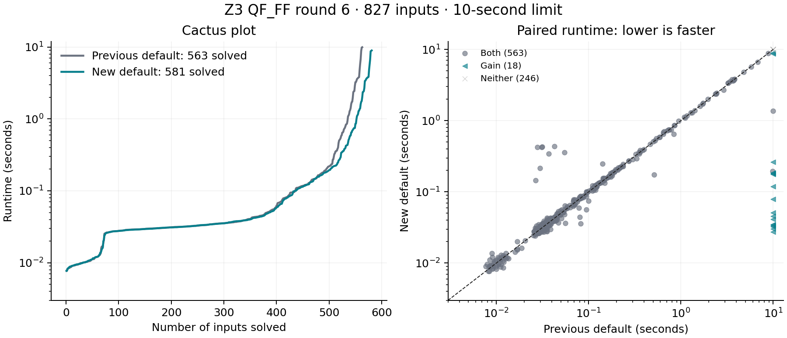

# QF_FF performance round 6

This round evaluates generic changes suggested by cvc5's finite-field architecture.
The acceptance criterion is improved coverage with comparable runtime. The retained
candidate enables disjunctive Boolean-domain rewriting and signed interval bit
propagation. Four other prototypes remain disabled by default.

## What changed

* `ff.disjunctive_bits`: after constant propagation, rewrite a disjunction of two
  field equalities into the product of their differences being zero, restricted
  to candidate univariate Boolean domains. Over a field this is an equivalence,
  independent of the domain-detection heuristic. It lets existing algebraic bit
  reasoning see exporters' `x=0 or x=1` domains. Original assertion dependencies
  are preserved. Named zero/minus-one constants are handled before detection.
* `ff.bit_bounds`: given proved Boolean digits and pinned constants, bound a
  signed linear combination as an integer interval. A field zero requires an
  integer multiple of the modulus inside that interval. Test each digit's two
  possibilities to infer a pin or a contradiction. The check includes all
  possible multiples, so modular wraparound is handled rather than assumed away.
  The derived facts carry the equation, used pins, and Boolean-domain premises.

These transformations do not use benchmark names, source-generator names, circuit
sizes, particular moduli, or recorded expected results. No proof reconstruction
was added; certificates remain v2. Comments explain each algebraic inference.

## Other experiments

All prototypes have independent `smt.ff.*` / per-solver switches. They remain
**off by default**:

* `linear_split`: bounded separate linear/nonlinear basis computations and sharing
  of their consequences before ordinary elimination. Packing definitions remain
  in the linear subsystem during this prepass. This is a bounded prepass, not a
  complete reimplementation of cvc5's cooperating split solver.
* `basis_bits`: recover digit consequences after basis computation; when used
  with the split prepass, test Booleanity by ideal membership. Also permits
  unequal-width no-wrap binary equalities, forcing unmatched high digits to zero.
* `compact_matrix`: sorted contiguous sparse coefficient rows, merge-based row
  elimination, smaller critical-pair batches, and a row-storage budget charged
  by allocated capacity and provenance. Small-prime coefficients still use exact
  uint64 arithmetic; large primes stay on the arbitrary-precision backend.
* `model_search`: a sufficient zero-dimensionality test based on leading pure
  powers; bounded linear dependence among normal forms of powers yields a
  univariate ideal relation. Diversified, individually bounded coordinate probes
  and sparse witnesses on more variables try to construct SAT models. Failed
  probes cannot establish UNSAT.

The initial screen has 66 inputs: all 21 previously measured cvc5-only successes,
plus five deterministic hash-selected representatives per available family.
The corrected second screen moves the disjunction rewrite after constant
propagation and broadens bounded sparse-witness probing. Results:

| Screen / variant | Solved / 66 | Gains / losses vs paired baseline |
| --- | ---: | ---: |
| screen: baseline | 33 | — |
| screen: basis_bits | 32 | 0 / 1 |
| screen: linear_split | 31 | 0 / 2 |
| screen: compact_matrix | 33 | 0 / 0 |
| screen: model_search | 33 | 0 / 0 |
| screen: bit_bounds | 34 | 1 / 0 |
| screen2: baseline | 32 | — |
| screen2: disjunctive_bits | 36 | 4 / 0 |
| screen2: bits | 38 | 6 / 0 |
| screen2: model_search | 32 | 0 / 0 |
| screen2: bits_model | 38 | 6 / 0 |

The two screens have separate baseline runs; near-limit timing varies. The first
disjunction prototype ran before named constants were propagated and therefore
missed the intended exporter patterns. Its ineffective measurement remains archived.

The interval rule tests part of the proposed carry/bounds direction. A separate
narrow bit-vector carry backend and shared polynomial DAG representation were
not implemented in this round. The measurements do not justify claiming that
these bounded prototypes reproduce the performance of CoCoA or cvc5 split.

## Paired evaluation

Baseline: frozen round-5 default binary. Candidate: the new default, with no
benchmark-specific parameter overrides. Each input/configuration starts a fresh
process, with a 10-second wall limit, 4 GiB sampled RSS limit, eight workers,
and rotated configuration order. Builds, correctness checks, and model validation
run separately from timing. This is a throughput experiment, not isolated latency.

The 648 prior inputs include the earlier development/validation samples and eight
public real-circuit inputs. The confirmation sample was selected before any new
implementation or outcome inspection, using SHA256(`round6-confirm:` + input hash)
within families and excluding all prior inputs. Five duplicate artifact members
were removed before evaluation, leaving **179 distinct fresh inputs**. The raw
pre-deduplication selection is retained. Fresh results are not used to tune the
candidate.

| Sample | Inputs | Previous default | New default | Gains / losses |
| --- | ---: | ---: | ---: | ---: |
| prior | 648 | 446 | 452 | 6 / 0 |
| fresh | 179 | 117 | 129 | 12 / 0 |
| **Total** | **827** | **563** | **581** | **18 / 0** |

No conflicting definite answers occurred.

| Family | Inputs | Previous default | New default |
| --- | ---: | ---: | ---: |
| ASHR | 32 | 31 | 31 |
| CirC-D | 148 | 121 | 121 |
| CirC-S | 180 | 59 | 62 |
| QED2 | 56 | 26 | 41 |
| Real | 8 | 3 | 3 |
| Seq | 100 | 100 | 100 |
| Small | 148 | 114 | 114 |
| TV | 73 | 65 | 65 |
| TV-pureFF | 82 | 44 | 44 |

Runtime on inputs solved by both binaries (fresh-process wall seconds):

| Sample | Common successes | Previous total | Candidate total | Geometric-mean candidate / baseline |
| --- | ---: | ---: | ---: | ---: |
| prior | 446 | 107.127 | 90.965 | 1.072 |
| fresh | 117 | 33.371 | 33.781 | 0.973 |

The geometric mean excludes pairs where both runs finish below 50 ms to reduce
startup-noise dominance. It is not an all-input speedup; timeouts are excluded
from common-success timing. Timeout-capped totals remain in the JSON summaries.

The largest aggregate timing outliers were repeated three times in isolation:

| Input | Previous median | New median |
| --- | ---: | ---: |
| `bitsum_15_layers_1.smt2` | 0.026 | 0.026 |
| `bitsum_7_layers_5.smt2` | 0.030 | 0.030 |
| `sound_bvsgt_4.smt2` | 0.128 | 0.134 |

The large early-run bit-sum slowdowns did not reproduce. All original primary
measurements remain included; no outliers were removed from scores or timings.

The plots include both primary samples. Timeout coordinates are capped at 10 s;
the cactus curves include solved inputs only. Measurements use eight concurrent
workers, so these are throughput-run timings rather than isolated latencies.

## Correctness

All **14 regression commands passed** on the final default build. The new
suite checks 360 independently enumerated random systems and returned cores,
160 signed Boolean-interval cases including wraparound, absent Boolean premises,
unequal bit widths, disjunctive domain spellings with named constants, and
assumption/core preservation. It exercises ideal-derived univariate relations
and model probes. Another 96 coefficient-boundary cases compare scalar and
packed matrix paths at primes below/above 2^32 and BN254. Existing suites include
150 random comparisons with cvc5 1.4.0, theory combination, incrementality,
models, caches, root lemmas, preprocessing, and proof-request rejection.
Global and per-solver controls were explicitly checked both enabled and disabled.

Independent Python evaluation validates **all 308 SAT model runs** in the
primary samples. All 12 symbolic Poseidon sentinels retain definite answers, and
all 16 associated model runs validate. Model retrieval/evaluation is outside
the timed benchmark runs.

## Isolated comparison with cvc5 1.4.0

Three repetitions, one worker, 10 seconds per run. Median seconds; TO means all
three repetitions timed out. These seven targeted cases are not a full-corpus
comparison with cvc5 1.4.0. All definite answers below are UNSAT.

| Input | New Z3 | cvc5 1.4.0 GB | cvc5 1.4.0 split |
| --- | ---: | ---: | ---: |
| `sound_bvashr_4.smt2` | 1.288 | 2.114 | 4.003 |
| `sound_bvudiv_3.smt2` | 0.182 | 3.995 | TO |
| `sound_bvurem_3.smt2` | 0.239 | 3.024 | TO |
| `Num2Bits@bitify@circomlib_8.smt2` | 0.025 | TO | 0.069 |
| `GreaterEqThan@comparators@circomlib_8.smt2` | 0.026 | TO | 0.084 |
| `Num2Bits@bitify@circomlib_128.smt2` | 0.070 | TO | 1.041 |
| `BinSum@binsum@circomlib_32_2.smt2` | 0.042 | TO | 0.614 |

## Limits and reproducibility

On **819 exact-hash matched paper inputs**, joining the new results to
historical cvc5 1.3.4 measurements gives Z3 **578**, GB **274**, split
**463**, and their union **516** solved. The union still solves
**19 inputs** missed by Z3; Z3 solves **81** missed by
both cvc5 configurations. Existing wrong-answer adjudications are applied, and
there are no remaining definite-answer conflicts in this join. These historical
counts must not be presented as a new full-corpus cvc5 1.4.0 comparison.

The 10-second limit is part of these results. A timeout is not evidence of a wrong
answer. SAT model validation and independent finite enumeration establish more
than agreement between two solvers, but do not replace a formal proof of the
implementation. Larger matrix systems and more complete model construction remain
open performance work.

Results, exact input bytes, binary hashes, source overlays, regression logs,
selection protocol, and exploratory ablations are stored under
`tests/finite_field/results/performance-round6/`. The experiment archive preserves
rejected configurations. Certificates, extension fields, and quantified reasoning
remain outside the v1 scope described in `doc/QF_FF.md`.
