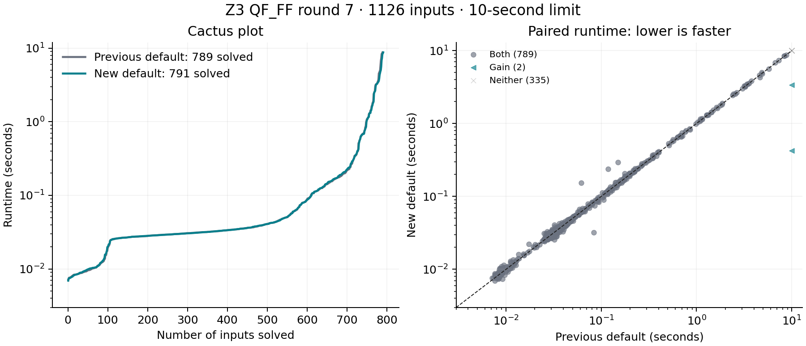

# QF_FF performance round 7: independent algebra experiments

The retained default adds a bounded compact-encoding retry. On **1,126 distinct
inputs at 10 seconds**, the previous default solves **789** and the new default
**791**: two gains, no losses, and no SAT/UNSAT disagreements. This is a modest
coverage improvement, not a resolution of the previously identified cvc5 gaps.
The implementations add no CoCoA dependency or imported CoCoA source.

## Retained behavior

`ff.compact_retry=true` keeps the previous encoding as the first attempt. Only
polynomial-size exhaustion **during encoding** triggers a single retry from the
untouched goal, introducing fresh variables with exact defining equations.
Affine bit packs stay visible. Definitions prevent repeated nonlinear expansion;
original-variable models are reconstructed and checked against the input AST.

The retry has at most `max(1, ff.max_steps / 16)` work units, further reduced by
the first attempt's per-field encoding expenditure. At the default work limit,
this is at most 125,000 units. Both attempts retain statistics and cancellation.
The rule does not depend on a benchmark name, field modulus, or expected answer.
It applies to `ff-solve`, including calls from `ff-sat`; the native SMT theory
does not gain this retry. Direct `ff.compact_encoding` remains false by default.

A first version gave the retry the full remaining algebra allowance. It solved
695 rather than 692 of the initial 1,001 inputs, but isolated repetitions exposed
a MACI regression: median 4.615 to 6.647 seconds. That version was rejected.
The capped retry was evaluated again on all 1,001 inputs and on a further 125
previously untouched inputs, selected before the budget revision. It sacrifices
one of those initial three gains to control the cost of unsuccessful probes.

## Experiments and decisions

Each transformation and algebraic criterion has its justification next to the
implementation. Flags below are independently configurable and **false by
default**. They are prototypes for broader evaluation, not claims of speedups.

| Flag | Implemented idea | Decision from the development screen |
| --- | --- | --- |
| `ff.sugar_pairs` | Propagated sugar degree for critical-pair scheduling, for small and large fields | No coverage gain |
| `ff.gm_pairs` | Minimal-LCM Gebauer–Möller pair installation and strict chain deletion; retain stable basis rows for deferred witnesses | No coverage gain |
| `ff.div_masks` | Support masks reject impossible divisors before exact multiplicity checks, including matrix preprocessing | No coverage gain; this is not a full divisor index |
| `ff.geobucket` | Geometric polynomial buckets for scalar reduction, preserving dependencies through cancellation | No coverage gain |
| `ff.small_coefficients` | Exact word products below 2^32, canonical-residue and inverse-of-one shortcuts | No coverage gain; no new multi-limb kernel for cryptographic primes |
| `ff.compact_encoding` | Fresh definitions before nonlinear expansion, preserving affine packs and protecting nonlinear definitions from immediate substitution | Direct use regressed coverage; retain only the bounded retry described above |
| `ff.adaptive_reduction` | Recover from matrix storage exhaustion by reducing original S-polynomials scalarly in the same basis, charging spent work | No coverage gain |
| `ff.bounded_elimination` | Estimate substitution term/degree growth and retain expensive equations instead of eagerly substituting | No coverage gain |

The frozen 73-input screen includes all 19 prior cvc5-only cases plus
hash-selected family representatives. Individual scheduling, mask, bucket, and
coefficient changes each solve the same 40 cases as the baseline. Initial direct
compaction solves 28, with one gain and 13 losses. Preserving affine bit packs
improves this to 34, with one gain and seven losses. Matrix recovery and bounded
elimination still solve 40. A 14-case retry check preserves all 13 old successes
and adds the compact-encoding gain. These development samples guided the
candidate; they are not untouched confirmation data.

## Final comparison

| Cohort | Inputs | Previous default | Retained default | Gains | Losses |
| --- | ---: | ---: | ---: | ---: | ---: |
| Previously measured sample | 827 | 581 | 583 | 2 | 0 |
| Fresh sample selected before implementation | 174 | 111 | 111 | 0 | 0 |
| Further confirmation selected before the budget revision | 125 | 97 | 97 | 0 | 0 |
| **Total** | **1,126** | **789** | **791** | **2** | **0** |

Both gains are large-field translation-validation inputs:

- `compilation-sound-random-04v-008t-pureff-zokref-255b-0s.smt2`:
  timeout to UNSAT, 3.365 seconds in the final paired run.
- `compilation-sound-random-04v-008t-pureff-circ-255b-0s.smt2`:
  timeout to SAT, 0.422 seconds, with independent original-input model validation.

The new confirmation sample demonstrates no observed coverage regression; it
provides no additional coverage gains. The 789 jointly solved inputs total
184.560 seconds for the baseline and 185.801 seconds for the candidate, a 0.67%
increase. Per-cohort geometric candidate/baseline ratios on common cases taking
at least 50 ms in either configuration are 1.006, 1.004, and 1.048 respectively.
Short runtimes and concurrent workers make isolated repetitions important.
Across all cohorts, the corresponding geometric ratio is 1.010.

The final isolated MACI median is **4.699 to 4.846 seconds** (+3.1%), replacing
the rejected 44% regression. Both gains repeat in all three isolated runs:
candidate medians are 3.082 seconds (UNSAT) and 0.405 seconds (SAT), while the
baseline always times out. Two short determinism cases do retain measurable
overhead: `compilation-deterministic-none-20v-000t-ff-zokref-255b-ors.smt2`
goes from 0.057 to 0.152 seconds, and
`compilation-deterministic-none-12v-064t-ff-zokref-255b-0s.smt2` from 0.115 to
0.234 seconds. Thus comparable aggregate performance does not mean every input
is equally fast. We accept this bounded absolute cost for the two coverage
gains; latency-sensitive callers can disable `ff.compact_retry`.

## Validation and reproducibility

The final binary passed all 15 recorded regression commands before timing.
The new C++ tests perform 512 basis-equivalence, S-pair-completeness, and
provenance checks across 64 random systems over F7, two primes around the 2^32
boundary, and BN254. They also force matrix storage overflow with successful
scalar recovery and exercise support-mask collisions above 64 variable IDs.
The new Python suite includes 360 solver/core checks, compact-definition model
reconstruction and incremental scopes across field sizes, and local/global
retry controls. Existing suites cover theory combination, roots, bit propagation,
basis caching, resource limits, proof rejection, and exhaustive semantics.
Random differential checks also use cvc5 1.4.0; this is not a new full-corpus
cvc5 1.4.0 comparison.

All **473 SAT model runs** in the final primary comparison passed independent
Python evaluation of the original assertions. The 12 Poseidon sentinels preserve
coverage in both configurations, and all 16 SAT model runs from those sentinels
also pass. These checks validate witnesses, not general UNSAT certificates.

## Remaining cvc5 differences

On the original 819 exact-matched paper inputs, the retained solver solves 580,
versus 274 for historical cvc5 GB, 463 for historical cvc5 split, and 516 for
their union. There are 83 Z3-only cases and **19 cvc5-only cases**. These use the
previous cvc5 **1.3.4** measurements with the existing wrong-answer adjudications;
they must not be presented as a fresh comparison against cvc5 1.4.0.

The enlarged sample contains 1,118 exact-matched paper inputs (plus eight real
circuit queries outside that reference corpus). On those 1,118, Z3 solves 788,
historical cvc5 GB 400, split 635, and their union 699. There are 119 Z3-only
cases and 30 cvc5-only cases: the original 19 plus 11 in the added samples.
No contradictory validated answers occur in either join.

All 19 previously identified misses remain. The local scheduling, reduction,
and arithmetic prototypes have therefore not closed the difficult basis-growth
and storage gaps. See [QF_FF_REMAINING_GAPS.md](QF_FF_REMAINING_GAPS.md) for the
earlier case-by-case diagnosis. A scalable algebra backend and cheaper reuse
across Boolean assignments remain useful directions, rather than demonstrated
improvements from this round.

## Resource protocol and archived evidence

Proof reconstruction remains v2. Input dependency sets support conflict
explanations but are not certificates. See [QF_FF_CERTIFICATES.md](QF_FF_CERTIFICATES.md)
for fresh-definition and reduction-recording obligations.

Primary timings use 10-second wall limits, sampled 4 GiB RSS limits, eight
workers, fresh processes, rotated variant order, and three untimed warmups per
binary. Neither binary receives parameter overrides: both are measured defaults.
No builds or correctness suites overlap timed comparisons. Follow-up latency
runs use one worker and three repetitions with alternating variant order.
The 827/174 cohorts were frozen before implementation; the last 125 exclude all
1,001 previous hashes and use deterministic hash order within artifact families.

Raw measurements, exact hashed inputs, source overlays, experiment history,
validation records, and binary/source hashes are in
[`tests/finite_field/results/performance-round7`](../tests/finite_field/results/performance-round7/).
The exploratory unlimited-retry binary and results are preserved separately
from the retained binary. Figures have both PNG and SVG versions.
