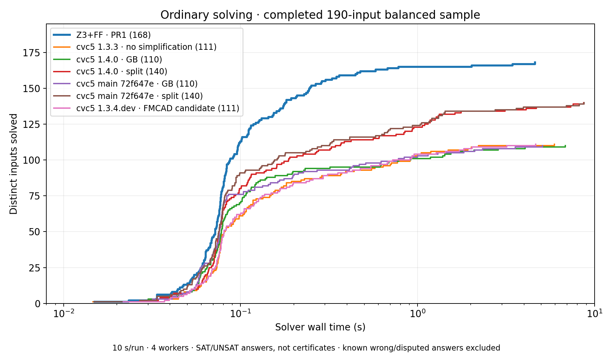
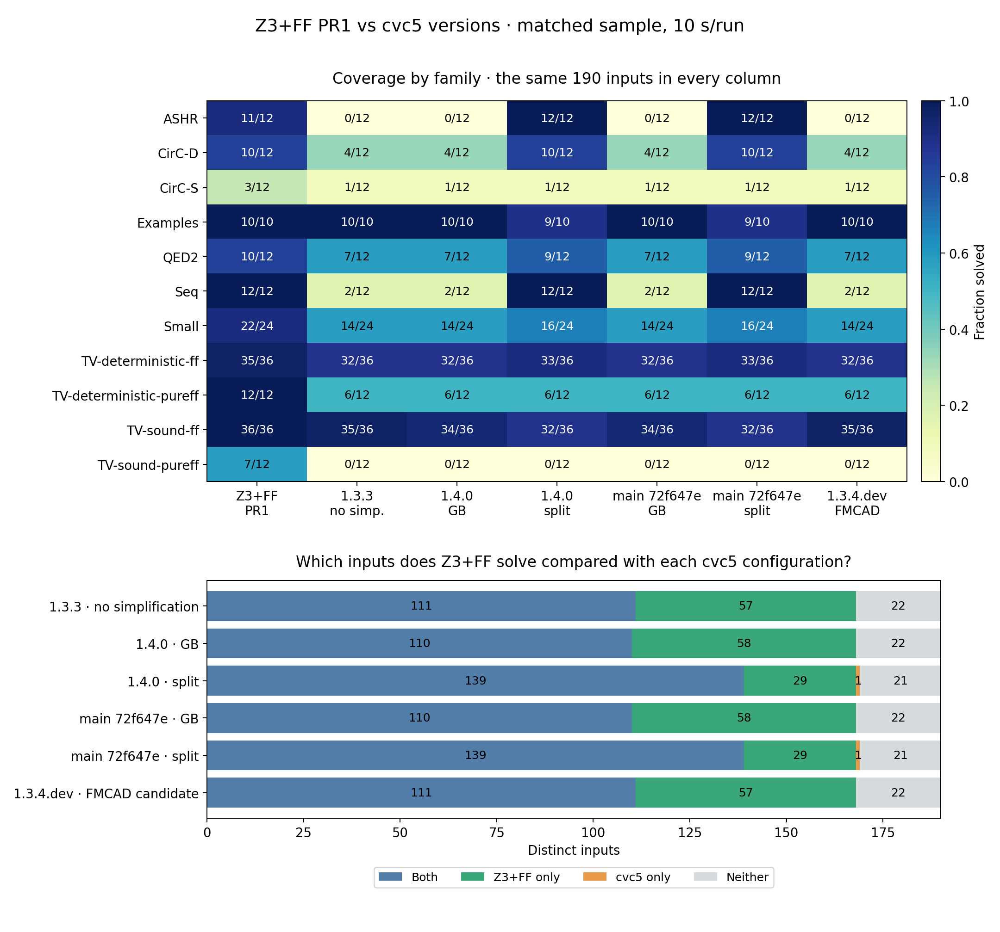

# Z3+FF PR1 vs pinned cvc5 versions

These figures use the **complete, matched 190-input balanced sample** from the
September 29 multisolver campaign, not its still-running full-corpus pass.
The frozen Z3 executable is the corrected backend accepted for PR1 at
`4eda0e5ba`. No experimental search changes are included.

The sample selects up to 12 inputs per benchmark family and field-width band
(at most 6 bits, 7–16 bits, above 16 bits), using a fixed seed without looking
at solver outcomes. Its 190 distinct inputs cover CAV 2023, CAV 2024 and FMCAD
2026 artifacts. This deliberately balanced sample is not a corpus-weighted
estimate of all 4,212 inputs. The figures exclude all partial full-pass data.

| Configuration | Solved / 190 |
|---|---:|
| Z3+FF PR1 | 168 |
| cvc5 1.3.3, simplification disabled | 111 |
| cvc5 1.4.0, GB | 110 |
| cvc5 1.4.0, split | 140 |
| cvc5 main `72f647e`, GB | 110 |
| cvc5 main `72f647e`, split | 140 |
| cvc5 1.3.4.dev, FMCAD candidate, simplification disabled, proof output off | 111 |

Each split configuration shares 139 solved inputs with Z3, solves one that Z3
misses, and misses 29 that Z3 solves. Both miss 21. Other displayed cvc5
configurations have no cvc5-only success on this sample. These are sample and
budget-specific findings, not a claim of general solver superiority.

The limit is 10 seconds per solver process, four workers, with a sampled 4 GiB
process-tree RSS limit on the native ARM64 M2 Max host. Other local work was
running, so small timing differences are not isolated causal measurements.
Syntax-only compatibility adaptations occur outside the solver timer; input
hashes are retained. SAT/UNSAT (or an entirely definite incremental answer
sequence) counts as solving, not proof checking. Known wrong answers and
unresolved disagreements are excluded; no disagreement is present in this
sample. The known split false-UNSAT reproducer is not in this sample.

Main is the **pinned** `72f647e` build, not the latest upstream HEAD. Library and
compiler differences remain between executables. The FMCAD candidate's ordinary
solving results here must not be read as its checked-proof coverage.

Reproduce both PNG and PDF figures with `python3 plot.py` (Matplotlib and NumPy).
The adjacent [measurements](measurements.jsonl), [selection](sample.json),
[summary](summary.json), [configuration and binary provenance](metadata.json)
and [version outputs](versions.json) preserve the exact completed sample.
The corrected-backend acceptance archive documents the executable's build;
its embedded Git version string predates the final documentation commit.
